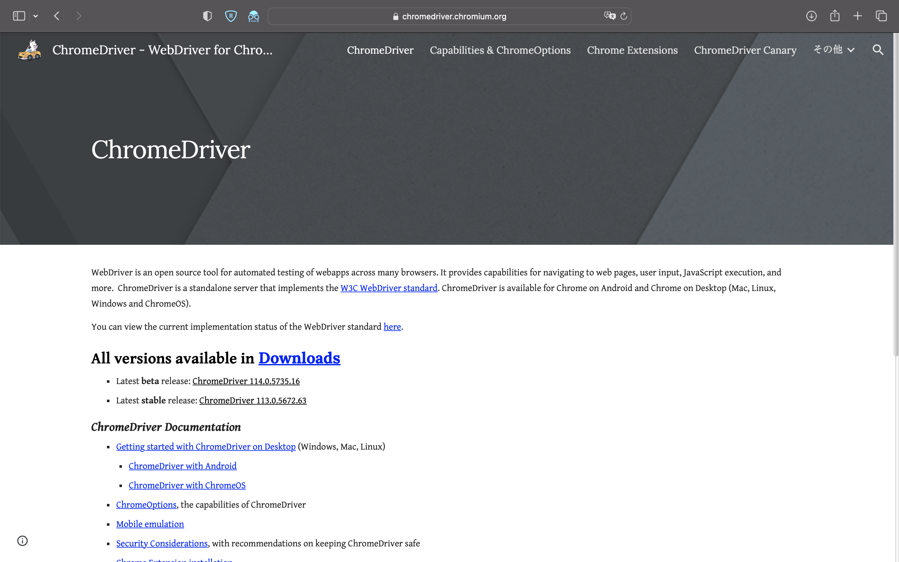

日本語バージョンは[こちら](README.ja.md)をクリックしてください。

## Summary
This is a scraping code for the Tokyo Tech Portal.
In this code, you have to enter your Tokyo Tech ID, password, and matrix to log in.
I searched git, but I couldn't find anyone who has created this code with version 4.3 or higher.
The contribution of this code is to be able to scrape the Tokyo Tech Portal with the latest version of selenium.

## Usage
This code was created with selenium 4.8.3, ChromeVersion 113.0.5672.63 (Official Build).

Chromedriver is required for scraping, but gitignore is used for rights reasons. Please access from this [chromedriver](https://chromedriver.chromium.org), and when you access the link, you will see the screen like the following screenshot, so please check the version and download ChromeDriver 113.0.5672.63(Official Build). Please check the version and download ChromeDriver 113.0.5672.63 to the same directory.

In addition, you need to create a csv file of the student's personal information, so please enter each information in Generate_csv.ipynb and create [student_id.csv](student_info/student_id.csv), [student_matrix.csv]( student_info/student_matrix.csv).
These operations should be performed locally.

Above, when you enter the personal information of the student, the scraping code will work, and we hope you will use it with modifications as appropriate.

## Environment
- python  3.11.2
- selenium    4.8.3
- ChromeDriver    113.0.5672.63
- ChromeVersion   113.0.5672.63（Official Build）

## About this Repository

The author assumes no responsibility for any problems that may occur with this code.
This code is licensed under the MIT License.