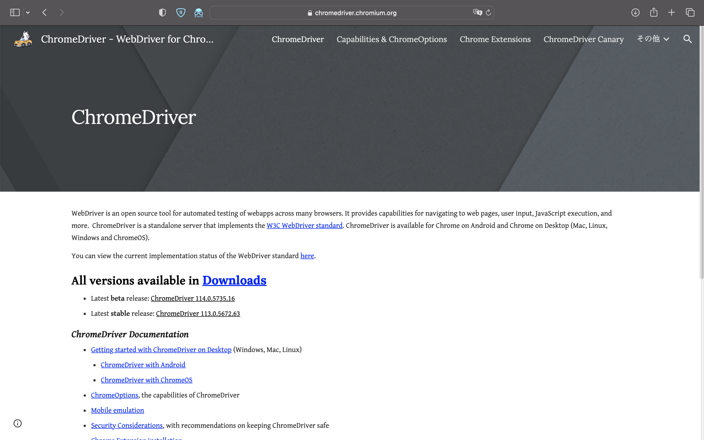

## 概要
東工大ポータルのスクレイピングのコードです。
本コードでは東工大のID、パスワード並びにマトリックスの入力をしてログインしています。
私がgit上で探した中では、4.3以上で作成されている方がいませんでした。
本コードの貢献はselenium最新バージョンで東工大ポータルをスクレイピングできることです。

## 使用方法
今回のコードはselenium 4.8.3で作成しました。ChromeVersionは113.0.5672.63（Official Build）です。

スクレイピングするためchromedriverが必要となりますが、権利の関係からgitignoreしています。こちらの[chromedriver](https://chromedriver.chromium.org)からアクセスしていただき、リンクにアクセスすると以下のスクリーンショットのような画面が出てくるのでバージョンをご確認の上ChromeDriver 113.0.5672.63を同じディレクトリにダウンロードしてください。

また、学生の個人情報をcsvで作成する必要があるのでGenerate_csv.ipynbに各情報を入力していただき[student_id.csv](student_info/student_id.csv)、[student_matrix.csv](student_info/student_matrix.csv)を作成してください。
これらの操作はローカルで行ってください。

上記、学生の個人情報を入力するとスクレイピングのコードが動くので適宜修正を加えてご活用いただければ幸いです。

## 環境
- python  3.11.2
- selenium    4.8.3
- ChromeDriver    113.0.5672.63
- ChromeVersion   113.0.5672.63（Official Build）

## 重要
本コードにおいていかなる問題が発生しても作者は責任を負いません。
また、本コードはMITライセンスとします。